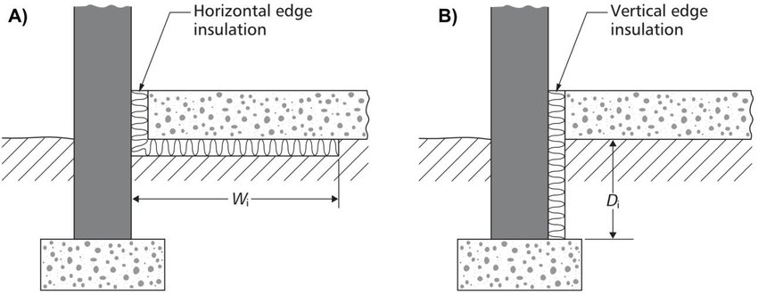

# Documentation for Floor U-Values Estimator

This documentation outlines the methods derived from [Appendix C of The Building Act 1984](https://gitlab.com/carboncoop/macquette/uploads/be22b5aa2b7106d41439b3dece5ffba6/FLOOR_U-VALUE_TABLES.pdf) which are used to create the **Floor U-Value Estimator** tool implemented in the Fabrics view.

## Some general notes

$P/A$ is the *exposed perimeter to area ratio* of the floor:
$$
P/A = \frac{exposed\; perimeter}{area}
$$

$R_{floor}$ is _the thermal resistance of the insulating floor material_, calculated by:
$$
R_{floor} = \frac{thickness}{conductivity}
$$
In the following calculations $R_{floor} = 0$ when no insulation is installed.

Tables $C_{1}$ - $C_{5}$ are expressed as functions in the methodology.

Take for example, $C_{1}(R_{floor},P/A)$

if we have $R_{floor} = 0.5$ and $P/A = 0.85$, we perform a lookup on the table:
$$
C_{1}(0.5, 0.85) = 0.64 \; W/m^2K
$$
The inputs are continuous values. In our method we simply discretize the inputs, selecting the nearest row/column.

e.g. $R_{floor} = 1.4$ and $P/A  = 0.41$:
$$
C_{1}(1.4, 0.41) = C_{1}(1.5, 0.40) = 0.30 \; W/m^2K
$$
A more accurate approach is interpolation between neighbouring column/row values. An example of this calculation is outlined in Appendix C. This level of accuracy is not required for the current iteration of the Floor U-Value Estimator.

$P/A$ is given from 0.05 - 1. For most rooms $P/A < 1$. Only very small rooms can have $P/A > 1$, so it is unlikely we'll encounter this scenario when estimating floor U-values.

## Solid Ground Floors

Without *edge* insulation the U-value is simply:
$$
U_{0} = C_{1}(R_{floor},P/A)
$$
Either horizontal or vertical edge insulation may be installed on Solid Ground Floors.

In this case the U-value is adjusted:
$$
U_{adjusted} = U_{0} - P/A\times(\Psi_{horizontal} + \Psi_{vertical})
$$
For horizontal insulation, $\Psi_{vertical}=0$, and vice-versa.

The adjustment factors $\Psi$ are calculated by:
$$
\Psi_{horizontal} = C_{2}(R_{horizontal},W_{i})
$$

$$
\Psi_{vertical} = C_{3}(R_{vertical},D_{i})
$$

$W_{i}$ is the width of horizontal edge insulation. $D_{i}$ is the depth of the vertical edge insulation (see figure above).

$R_{horizontal}$ and $R_{vertical}$ are the thermal resistances of the installed edge insulation and are calculated as as $R = thickness/conductivity$

In the code, tables $C_{2}$ and $C_{3}$ are stored as positive values, whereas they are negative in Appendix C. $U_{adjusted}$ takes this $-1$  factor into account.

## Suspended Floors

Uninsulated:
$$
U_{uninsulated} = C_{4}(H,P/A)
$$
Where $H$ is the _height of floor deck above ground level and ventilation opening area per unit perimeter of underfloor space_, in $m^{2}/m$.

In other words, $H$ is _how well ventilated_ the deck space is. It can take two values: 0.0015 (standard), or 0.0030 (well ventilated).

Insulated:
$$
U_{insulated} = \frac{1}{(1/U_{uninsulated}) - 0.2 + R^{suspended}_{floor}}
$$
$R^{suspended}_{floor}$ is for _the thermal resistance of the **suspended** floor deck_. It differs from the normal calculation for $R_{floor}$.
$$
R^{suspended}_{floor} = \frac{1}{U_{T}} - 0.17 - 0.17
$$
assuming thermal resistances of $0.17 \; m^{2}K/W$ for both the upper and lower surfaces of the floor deck.

$U_{T}$ is _the U-value of the **suspended** floor deck_, which is calculated using _[the Combined Method](./combined_method.md)_:

$$
U_{T} = \frac{2}{R_{upper} + R_{lower}}
$$

## Basement Floors

Uninsulated:
$$
U_{uninsulated} = C_{5}(D, P/A)
$$
where $D$ is the basement depth.

Insulated:
$$
U_{insulated} = \frac{1}{(1/U_{uninsulated}) + R_{floor}}
$$
