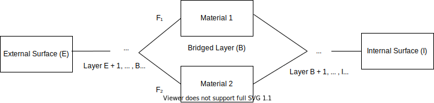
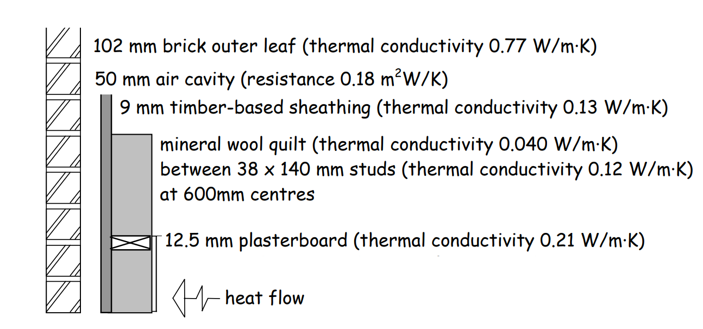
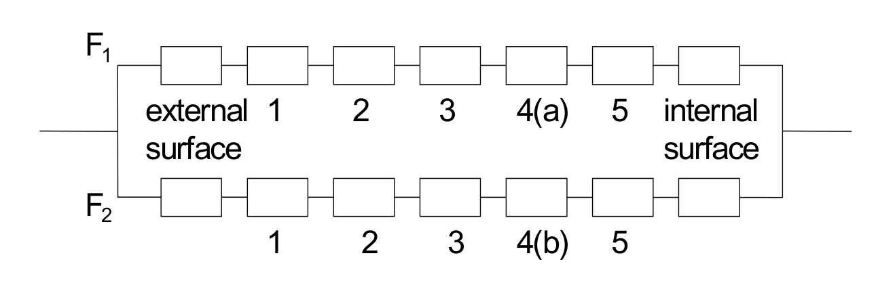
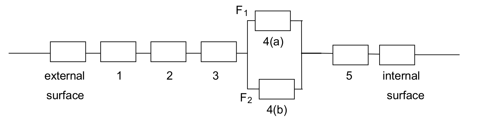

## The Combined Method for calculating the U-value of floors and walls with a bridged insulated layer

This is a distilled version of the documentation outlined in 6.B.1 and 6.B.2 of [Part J - Appendix A: Worked examples of U-value calculations using the Combined Method](https://www.gov.scot/binaries/content/documents/govscot/publications/advice-and-guidance/2020/02/tables-of-u-values-and-thermal-conductivity/documents/6-b---worked-examples-of-u-value-calculations-using-the-combined-method/6-b---worked-examples-of-u-value-calculations-using-the-combined-method/govscot%3Adocument/6.B%2B-%2BWorked%2Bexamples%2Bof%2BU-value%2Bcalculations%2Busing%2Bthe%2Bcombined%2Bmethod%2B%2B.pdf).

The procedure is as follows:

1. Calculate the upper resistance limit $R_{upper}$ by combining in parallel the total resistances of all possible heat-flow paths (i.e. sections) through the plane building element.

2. Calculate the lower resistance limit $R_{lower}$ by combining in parallel the resistances of the heat flow paths of each layer separately and then summing the resistances of all layers of the plane building element.

3. Calculate the combined U-value,

   ### $$U_{T} = \frac{2}{R_{upper} + R_{lower}}$$

### Upper resistance limit

<figcaption style="padding-top: 20px">Conceptual illustration of how to calculate the upper limit of thermal resistance</figcaption>
</img>

The bridged layer has materials 1 and 2: $M_{1}, M_{2}$, of fractions $F_{1}$ and $F_{2}$.

The layers $E + 1$ to $B-1$; and $B+1$ to $I - 1$, are the layers *in-between* the external/internal surface and the bridged layer.

$R_{1}, R_{2}$ are the sum total thermal resistances for branches $F_{1}, F_{2}$:

#### $$R_{1} = R_{E} + R_{E+1} + ... + R_{B-1} + R_{M_{1}} + R_{B+1} + ... + R_{I-1} + R_{I}$$

#### $$R_{2} = R_{E} + R_{E+1} + ... + R_{B-1} + R_{M_{2}} + R_{B+1} + ... + R_{I-1} + R_{I}$$

### $$R_{upper} = (\frac{F_{1}}{R_{1}}+\frac{F_{2}}{R_{2}} )^{-1}$$

### Lower resistance limit

<figcaption style="padding-top: 20px">Conceptual illustration of how to calculate the lower limit of thermal resistance</figcaption>
</img>

### $$R_{lower} = R_{E} + R_{E+1} + ... + R_{B-1} + (\frac{F_{1}}{R_{M_{1}}} + \frac{F_{2}}{{R_{M_{2}}}})^{-1} + R_{B+1} + ... + R_{I-1} + R_{I}$$

### Worked Example

This is an example for walls, but the same physics applies for floors.

<figcaption style="padding-top: 20px">Section through timber framed wall</figcaption>
</img>

| Layer | Material                                      | Thermal resistance $(m^{2}K/W)$ |
| ----- | --------------------------------------------- | ------------------------------- |
|       | external surface                              | 0.040                           |
| 1     | outer leaf brick                              | 0.132                           |
| 2     | air cavity                                    | 0.180                           |
| 3     | sheathing                                     | 0.069                           |
| 4a    | mineral wool quilt between timber studs (85%) | 3.500                           |
| 4b    | timer framing (15%)                           | 1.167                           |
| 5     | plasterboard                                  | 0.060                           |
|       | internal surface                              | 0.130                           |

Layers with their calculated thermal resistances (R = thickness/conductivity)

#### Calculating $R_{upper}$

<figcaption style="padding-top: 20px">Calculating the upper resistance limit</figcaption>
</img>

#### $$R_{1} = 0.040 + 0.132 + 0.180 + 0.069 + 3.500 + 0.060 + 0.130 = 4.111\ m^{2}K/W $$

#### $$R_{2} = 0.040 + 0.132 + 0.180 + 0.069 + 1.167 + 0.060 + 0.130 = 1.778\ m^{2}K/W $$

### $$R_{upper} = (\frac{0.85}{4.111}+\frac{0.15}{1.778} )^{-1} = 3.435\ m^{2}K/W$$

#### Calculating $R_{lower}$

<figcaption style="padding-top: 20px">Calculating the lower resistance limit</figcaption>
</img>

### $$R_{lower} = 0.040 + 0.132 + 0.180 + 0.069 + (\frac{0.85}{3.500} + \frac{0.15}{1.167})^{-1} + 0.060 + 0.130 = 3.304\ m^{2}K/W $$

#### Calculating $U_{T}$

### $$U_{T} = \frac{2}{3.435 + 3.304} \simeq 0.30\ W/m^{2}K$$

---

### Notes

This method is used to calculate the floor u-value for suspended floors with insulation including a single bridged layer. See the method for two bridged layers in [6.B.3](https://www.gov.scot/binaries/content/documents/govscot/publications/advice-and-guidance/2020/02/tables-of-u-values-and-thermal-conductivity/documents/6-b---worked-examples-of-u-value-calculations-using-the-combined-method/6-b---worked-examples-of-u-value-calculations-using-the-combined-method/govscot%3Adocument/).

Correction for air gaps is not included. See [6.B.2](https://www.gov.scot/binaries/content/documents/govscot/publications/advice-and-guidance/2020/02/tables-of-u-values-and-thermal-conductivity/documents/6-b---worked-examples-of-u-value-calculations-using-the-combined-method/6-b---worked-examples-of-u-value-calculations-using-the-combined-method/govscot%3Adocument/).
